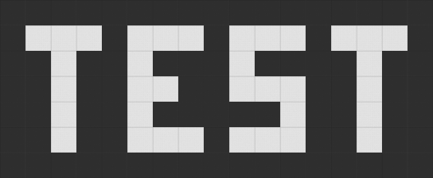
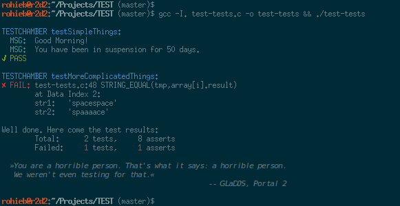

A simple-to-use, no-frills testing framework for C

Example Usage
-------------

Test code looks like this:
```c
#include <stddef.h>
#include <string.h>
#include <TEST.h>

// Some simple concepts:
TEST_CHAMBER(testSimpleThings) {
	// Print something to the console. Does not run any tests.
	TEST_PRINTF("Good Morning!");
	// understands printf syntax:
	TEST_PRINTF("You have been in suspension for %d days.", 50);

	// Test for a value to be nonzero
	TEST_ASSERT(1);

	// Test for equality
	TEST_EQUAL(1 + 1, 2);

	// Test for two strings to be equal
	char str[] = "Hello";
	TEST_STRING_EQUAL(str, "Hello");
}

// Some more advanced concepts:
TEST_CHAMBER(testMoreComplicatedThings) {
	// Test for first n elements to be equal
	TEST_ELEMENTS_EQUAL("Aperture Science Weighted Storage Cube",
			"Aperture Science Heavy Duty Super-Colliding Super Button", 16);

	// The Enrichment Center regrets to inform you that this next test is
	// impossible. Make no attempt to solve it.
	TEST_ELEMENTS_EQUAL("SUBJECT NAME", "SUBJECT HOMETOWN", 8);

	// Iterating over an array of values:
	char tmp[64];
	memset(tmp, 0, sizeof(tmp));
	typedef struct { char value[32]; char result[32]; } testdata_t;
	testdata_t array[] = {
		{ "science", "sciencescience" },
		{ "space", "spacespace" },
		/* failing for illustration purposes: */ { "space", "spaaaace" }
	};

	for(size_t i = 0; i < sizeof(array) / sizeof(testdata_t); i++) {
		// For easier error reporting, print our index every time when asserting
		TEST_SET_DATA_INDEX(i);
		strncpy(tmp, array[i].value, sizeof(tmp));
		strncat(tmp, array[i].value, sizeof(tmp));
		TEST_STRING_EQUAL(tmp, array[i].result);
	}
}

int main() {
	TEST_CHAMBER_RUN(testSimpleThings);
	TEST_CHAMBER_RUN(testMoreComplicatedThings);
	TEST_RESULTS();
}

```

The output looks like this:




License
-------

The content in this repository is licensed under the MIT License, see the file `LICENSE`.


Notes
-----

- Testing has proven to be completely safe. The Code, however, has not.
- Do not look at the operational end of The Code.
- Do not submerge The Code in liquid, even partially.
